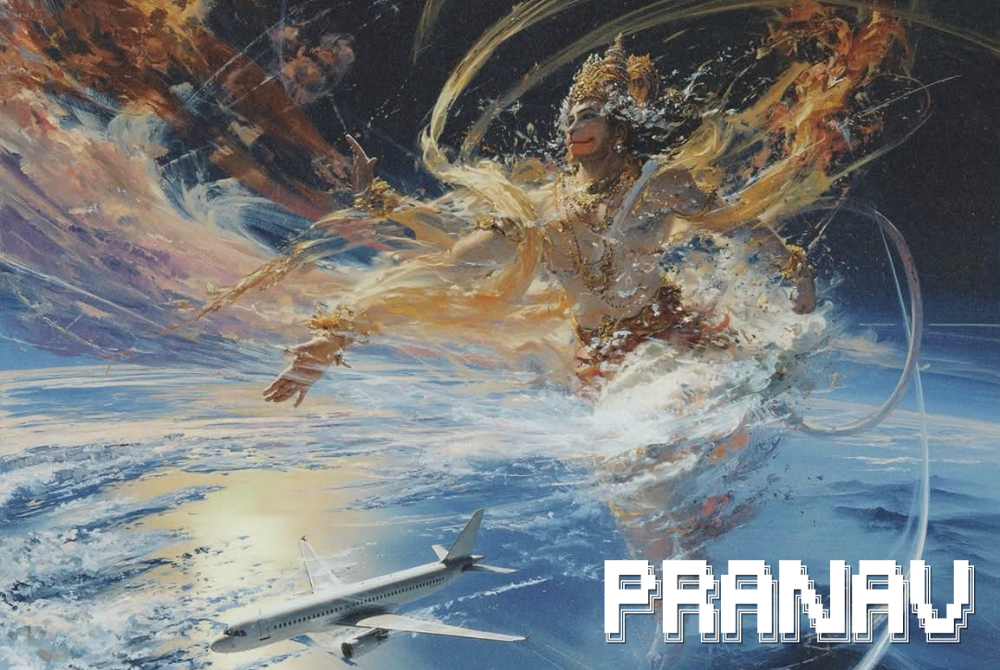

<div align="center">


</div>

<div align="center">

<a href="https://git.io/typing-svg">
  
</a>

<br/><br/>



<sub>Background artwork by Awedict. All credit to the original artist.</sub>

</div>

---

## 👨‍🚀 About Me

```yaml
name:        Pranav Punnajiche
studying:    Aeronautical Engineering
focus:       [Drone Design, Fighter Jet Aerodynamics, Stealth Tech, Prototyping, Embedded Electronics]
hobbies:     [Building drones, Drone piloting, DIY electronics, Studying fighter jets]
favorite_aircraft: [F-16 Fighting Falcon, B-2 Spirit Stealth Bomber]
superpower:  Going from CAD sketch → 3D print → flight test
currently:   Building the next generation of my custom drone 🚁
```

- 🔭 Designing and testing UAV airframes, from concept CAD to real flight
- ✈️ Fascinated by **fighter jets**, from the agile **F-16** to the flying-wing stealth of the **B-2 Spirit**
- 🛠️ A true **DIY engineer**: if I can't buy it, I build it
- 📊 I combine engineering with **business analytics** to make projects practical and cost-smart
- 🎯 Looking for internships and collaborations in aerospace, UAV and R&D

---

## ✈️ Aircraft I Admire

<div align="center">

<table>
  <tr>
    <td align="center" width="50%">
      
      <br/><br/>
      <b>🦅 F-16 Fighting Falcon</b><br/>
      <sub>Agile single-engine multirole fighter<br/>Fly-by-wire controls • Bubble canopy • Mach 2 class</sub>
    </td>
    <td align="center" width="50%">
      
      <br/><br/>
      <b>🦇 B-2 Spirit</b><br/>
      <sub>Flying-wing stealth bomber<br/>Low-observable design • Composite structure</sub>
    </td>
  </tr>
</table>


<sub>Photos: U.S. Air Force, public domain, via Wikimedia Commons</sub>

</div>

---

## 🧰 Tech & Skills

### 🏗️ CAD & Design
<p>
  
  
  
  
</p>

### 🚁 Drones & Aerospace
<p>
  
  
  
  
  
</p>

### 🔌 Electronics & DIY
<p>
  
  
  
  
  
  
</p>

### 📈 Business Analytics
<p>
  
  
  
  
  
</p>

---

## 🚀 Featured Projects

| Project | Description | Tools |
|---|---|---|
| 🚁 **Custom Quadcopter** | Designed and built frame, wiring and tuned flight controller | Fusion 360, Betaflight |
| ✈️ **RC Aircraft Wing Design** | Airfoil selection and structural layout | CATIA V5, SolidWorks |
| 🦅 **F-16 Scale Model (CAD)** | 3D model of the F-16 airframe for printing and study | Fusion 360, SolidWorks |
| 🦇 **B-2 Flying-Wing Study** | Blended-wing-body concept and stealth shaping study | CATIA V5, SolidWorks |
| 🔧 **DIY Electronics Rig** | Sensor + microcontroller telemetry system | Arduino, ESP32 |
| 📊 **UAV Cost Analysis** | Cost vs. performance study for drone builds | Excel, Power BI |

---

## 📊 GitHub Stats

<div align="center">


<br/>


<br/>


</div>

---

## 📫 Let's Connect

<div align="center">

<a href="https://linkedin.com/in/YOUR_LINK"></a>
<a href="mailto:pranavpunnajiche@gmail.com"></a>

<br/><br/>

<i>"The sky is not the limit, it's the playground."</i> ✈️


</div>
